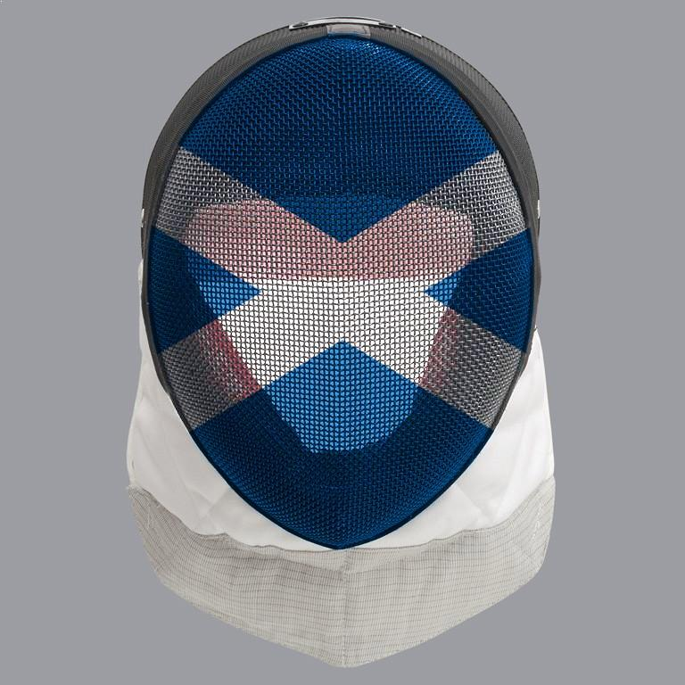
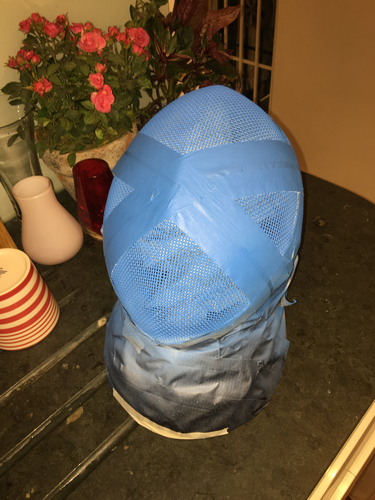
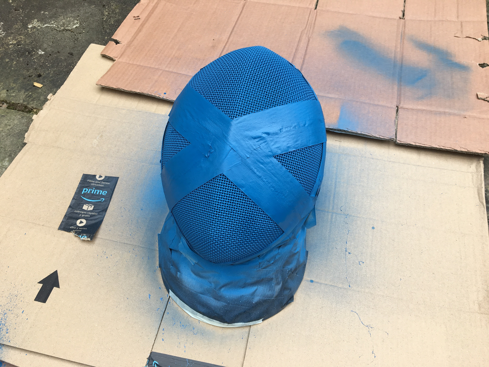
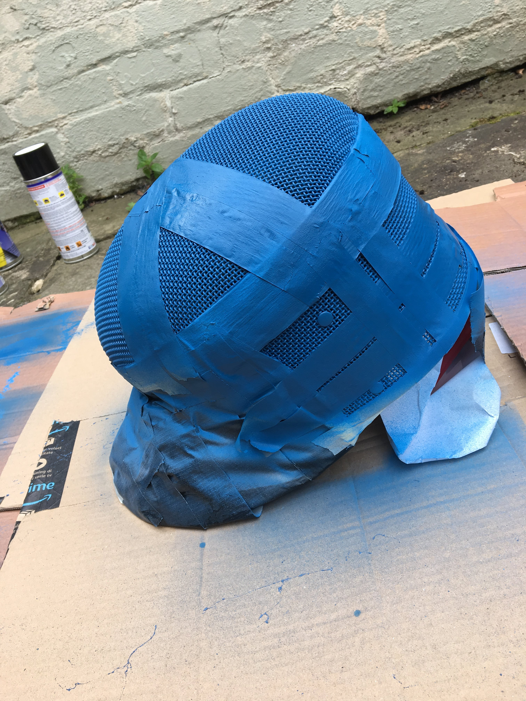
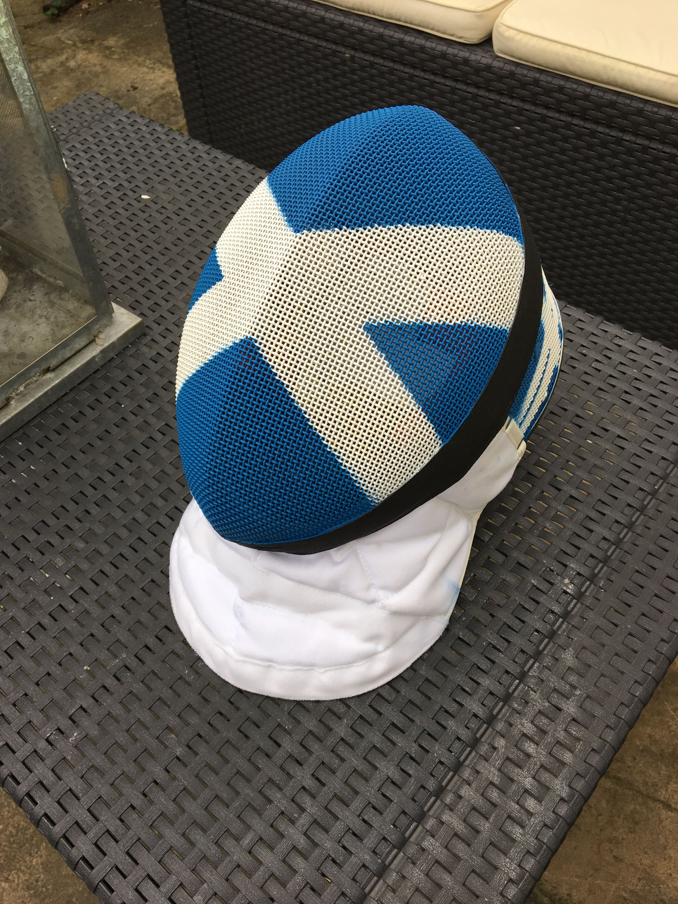
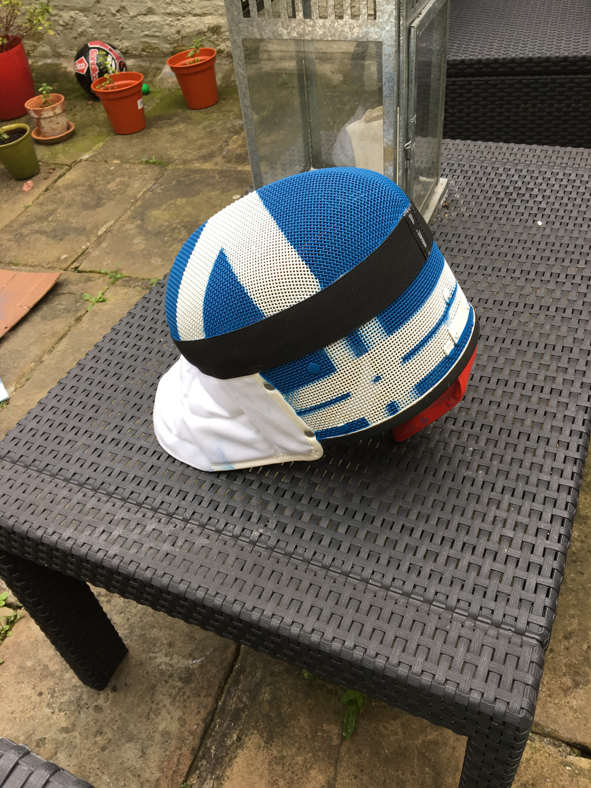
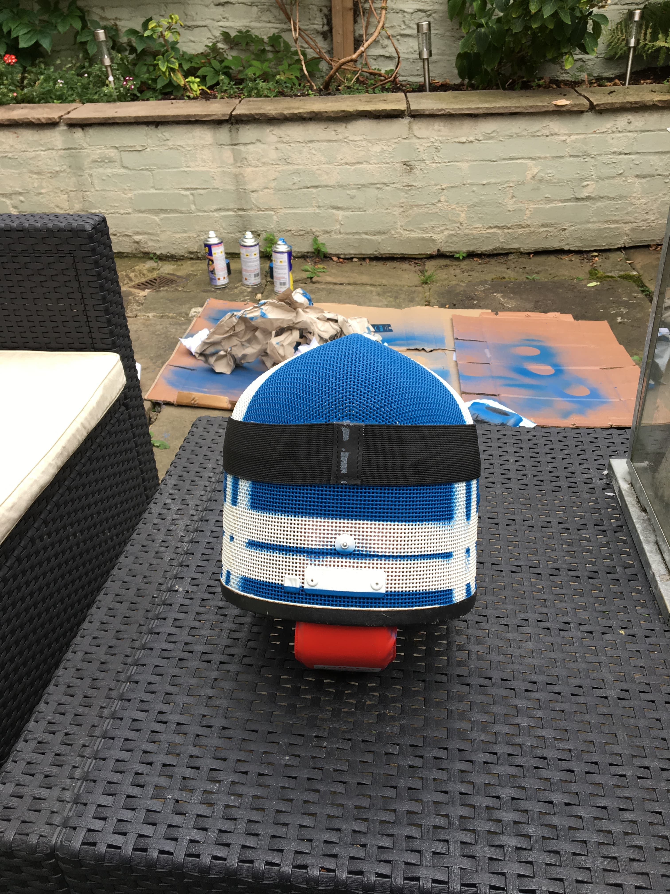
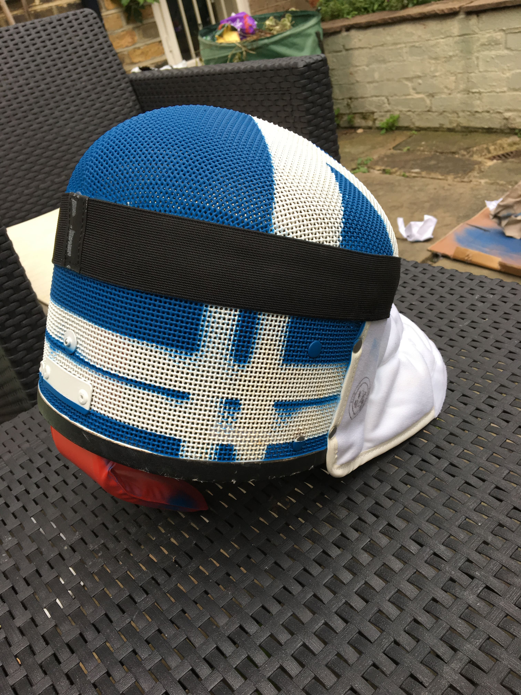
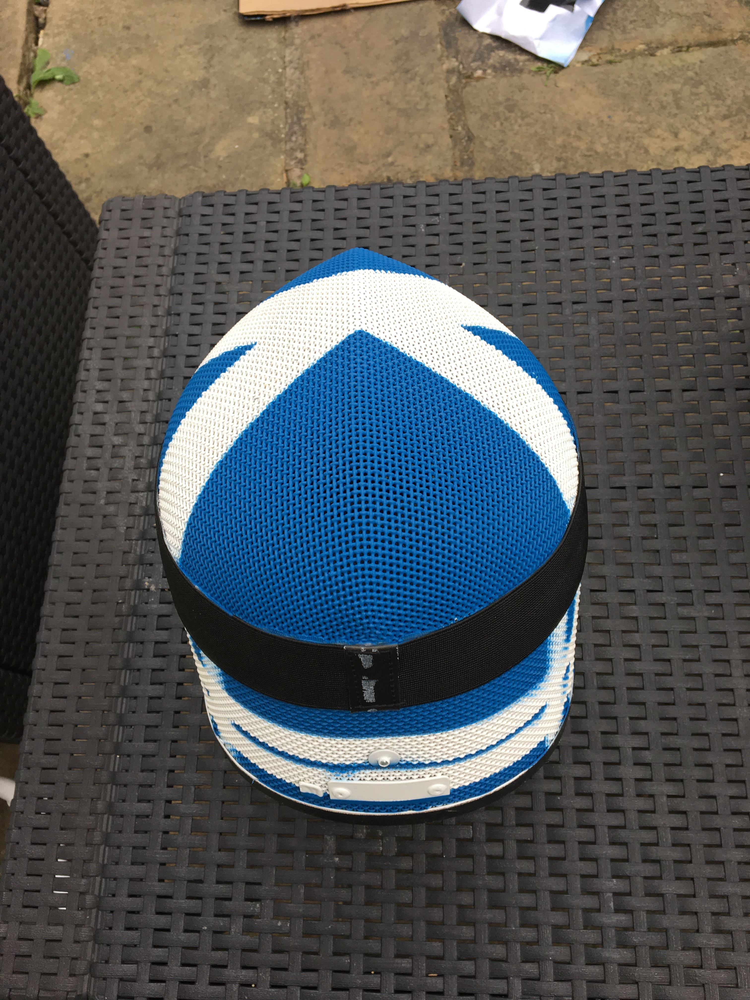
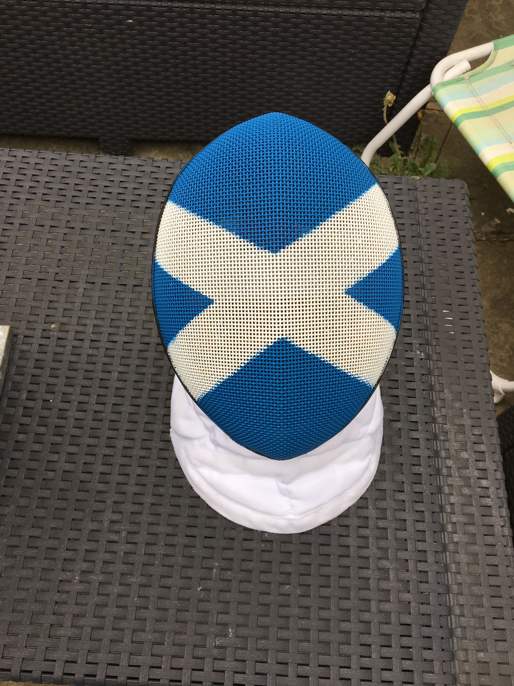

Following my design of the Scottish fencing mask, I thought that it would be great to bring it to life!  I love getting stuck in I decided to do it myself to see just how difficult (or simple!) it was as it's a service that I would like to offer in the future.  I have outlined the steps that I followed below.

<h3 class="steps">1. Do some research on how others have sprayed their own fencing masks</h3>

I did this through Google and speaking to a few contacts in industry. I expected the application to be along the lines of remoing the previous coats, applying a primer and then your template on top.  Here's what I found online:

<ul>
            <li>
                <a href="https://www.leonpaul.com/blog/the-story-of-the-flag-mask-and-how-to-make-your-own/" target="_blank">The story of the flag mask and how to make your own, a blog post from Leon Paul</a>
            </li>
            <li>
                <a href="https://www.youtube.com/watch?v=Vm3IZgFvrBM" target="_blank">Painting a fencing mask, a video by Medieval Review on YouTube</a>
            </li>
            <li>
                <a href="https://www.youtube.com/watch?v=Sd4xcPezta0" target="_blank">How to customise a fencing mask, a video by Kálmán Kozma on YouTube</a>
            </li>
        </ul>
<h3 class="steps">2. Decide on the design to be applied</h3>

At this point I had already decided on the design that I was going to use, having already created a design and explored others <a href="../ScottishFencingMaskDesign.html" target="_blank" >as part of my Scottish mask design project</a>.

At the last minute I decided to add some tartan to the top of the mask for a little variation and fun on space that would otherwise considered to be 'dead'.

<h3 class="steps">3. Tape up the parts of the mask not to be sprayed</h3>

I was spraying the entirety of the mesh which meant that there was a lot of taping up involved.  Anything that was fabric neede to be covered up as well as the back strap, depending on how picky one is I could also have tried to cover up the rivets on the mesh but I wasn't that bothered - and frankly life is too short.  I used duct tape to cover the majority of the mask (as recommended in the video by Leon Paul) as it's much easier not to be specific and then used masking tape for areas requiring finer edges (such as the rim of the mask).

<h3 class="steps">4. Spray the primer/first layer</h3>

My design consistend of only two colours which kept it relatively simple.  The first layer needed to be white so I applied this everywhere. The first layer has a few keys purposes:
<ul>
    <li>to plug anywhere where the paint has chipped</li>
    <li>to provide the base for the template that's going to be applied</li>
    <li>to cover up the original paint on the mask - usually when spraying a mask it will be to repair chips or change the design</li>
</ul>

The mask that I used originally had white paint on it but it was no longer consistent across the whole mask through general wear and tear.

The paint needs at least 45 minutes to dry between coats and ideally a few hourss that it dried properly on both the outside and inside layers. When the paint looks dry on the outside it might still be wet inside, if another layer is applied too soon then you'll get cracking.  Leaving the mask to dry and air out propely is also very important at the end so that you're not breathing fumes!

<h3 class="steps">5. Apply a second layer</h3>

This is so that the original paint is suitably covered and that the gaps have been filled properly, a single layer might not always be enough. Again leave to dry.

<h3 class="steps">6. Create a template with tape for the rest of the design</h3>

I used duct tape for the cross as it was an easy way to create a thick line.

<h3 class="steps">7. Apply a first layer of colour</h3>

Again, make sure to leave the paint to dry properly.
<h3 class="steps">8. Apply a second layer of colour</h3>

And once more leave the paint to dry properly.
<h3 class="steps">9. Peel off the tape</h3></h3>

Considerations - I didn't want to apply too many layers as I wasn't sure how many it might take to plug up the holes that are essential for sight and ventilation during fencing!

I thought that there might be some work needed to remove the original paint but there was nothing that indicated as such so I decided to ignore this step.  Already knowing what my design was and the template masking needed ()

Marked it out with duct and masking tape

Tried to re-spray my other mask in black but discovered that I had used the wrong type of paint and it chipped easily.

Wrong colour

Right colour

Final design

